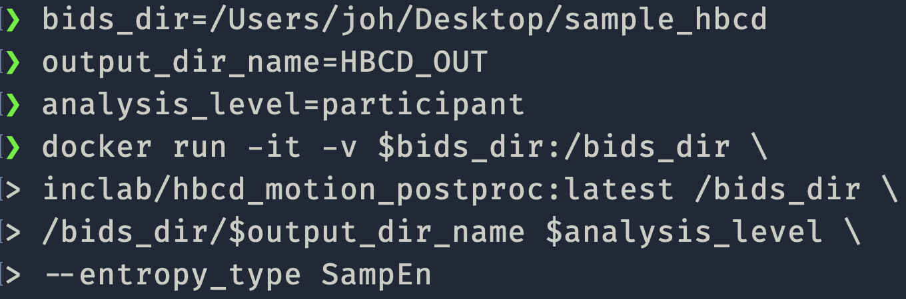

Testing
=======

To test HBCD-motion to ensure it's working as expected, please do the following:

Download Test Data
------------------
Download ``sample_hbcd.zip`` from `here <https://doi.org/10.17605/osf.io/rq3et>`_.

.. image:: images/test_instructions1.png
   :width: 600

.. image:: images/test_instructions2.png
   :width: 600

Once you extract the file, you should see a folder named ``sample_hbcd``. The folder should be structured in the following way:

.. _execute:

Execute HBCD-motion
-------------------
If you haven't already, set up HBCD-motion following instructions from this `page <https://hbcd-motion-postproc.readthedocs.io/en/latest/installation.html>`_. Then execute the processing pipeline with the test data using ``singularity``::

        bids_dir=/path/to/sample_hbcd (ex. /Users/joh/Downloads/sample_hbcd if working on a Mac)
        bids_out=/path/to/output/folder (ex. /Users/joh/Downloads/HBCD_out)
        container=/path/to/container (ex. /Users/joh/Downloads/hbcd_motion_postproc_latest.sif)
        analysis_level=participant
        singularity run -B $bids_dir:/bids -B $bids_out:/out $container /bids /out $analysis_level --entropy_type SampEn

If you use ``docker`` to process, 1) run the docker desktop, 2) open terminal and type the following::

      bids_dir=/path/to/sample_hbcd
      output_dir_name=HBCD_out
      analysis_level=participant
      docker run -it -v $bids_dir:/bids_dir \
      inclab/hbcd_motion_postproc:<version_number> /bids_dir \
      /bids_dir/$output_dir_name  $analysis_level --entropy_type SampEn

This is an example:

Notice that the processing output will be saved in the folder named ``HBCD_out``, the value of ``output_dir_name``.
This folder is placed inside ``bids_dir``.

If the processing pipeline works properly, you should see a screen like below:

.. image:: images/promising_start.png
   :width: 600

.. note::

   I added ``--entropy_type SampEn`` to reduce the CPU load. Calculating ``FuzzEn`` requires a lot of computing power, so the process may terminate.

Once the entire process is completed, you should see files are populated in your ``bids_out`` (or ``output_dir_name``) folder.

Your folder structure and generated files should be identical to what's showcased in `HBCD_OUT <https://osf.io/rq3et/files/osfstorage>`_.

