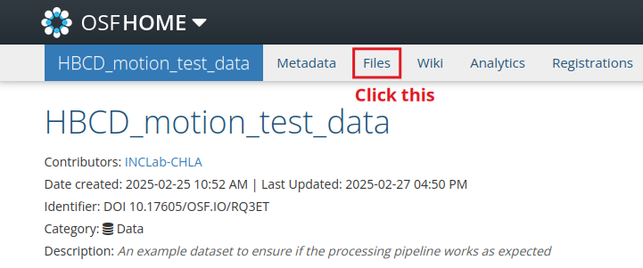
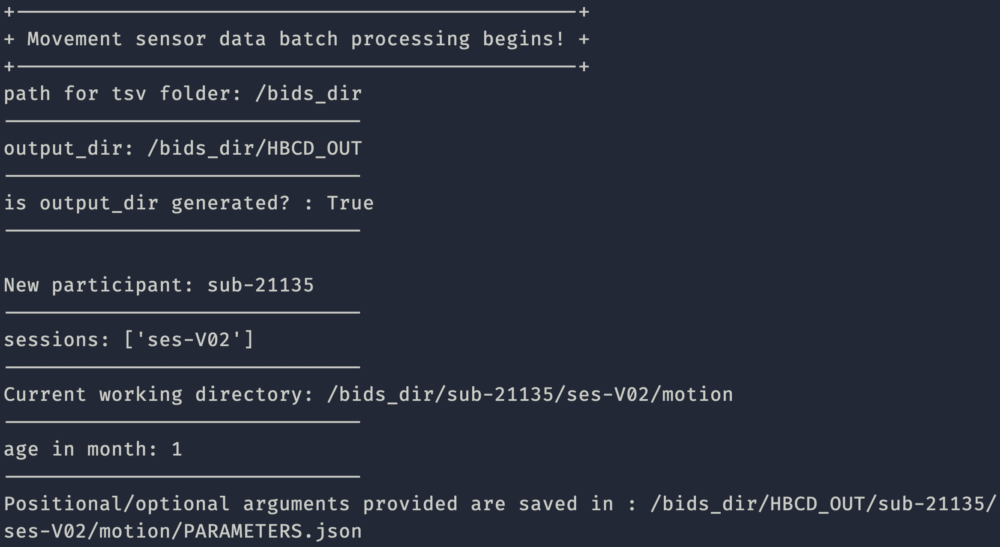

Testing
=======

To test HBCD-motion to ensure it's working as expected, please do the following:

Download Test Data
------------------
Download ``sub-21135.zip`` from `here <https://doi.org/10.17605/OSF.IO/HPV9Y>`_.

.. image:: images/test_instructions2.png
   :width: 600

Once you extract the file, you should see a folder named sub-21135. The folder should be structured in the following way:

.. image:: images/folder_structure.png
   :width: 600

Execute HBCD-motion
-------------------
If you haven't already, set up HBCD-motion following instructions from this `page <https://hbcd-motion-postproc.readthedocs.io/en/latest/installation.html>`_. Then execute the processing pipeline with the test data, e.g.: ::

        bids_dir=/path/to/sub-21135 (ex. /Users/joh/Downloads/sub-21135 if working on a Mac)
        bids_out=/path/to/output/folder (ex. /Users/joh/Downloads/HBCD_out)
        container=/path/to/container (ex. /Users/joh/Downloads/hbcd_motion_postproc_latest.sif)
        analysis_level=participant
        singularity run -B $bids_dir:/bids -B $bids_out:/out $container /bids /out $analysis_level --entropy_type SampEn

If the processing pipeline works properly, you should see a screen like below:

.. note::

I added ``--entropy_type SampEn`` to reduce the CPU load. Calculating `FuzzEn` requires a lot of computing power, so the process may terminate.

Once the entire process is completed, you should see files are populated in your ``bids_out`` folder.

.. image:: images/sample_output.png
   :width: 600

